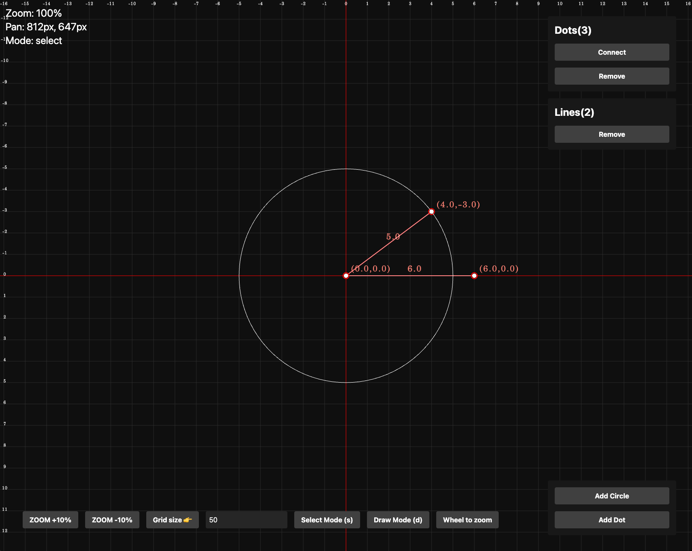

# visualize-math

2 Dimension Math Visualization website.

[DEMO](https://livemehere.github.io/visualize-math/)

## Features

- create dot
- create line by connecting dots
- create circle
- display dot position & line length
- scaling & moving & zooming
